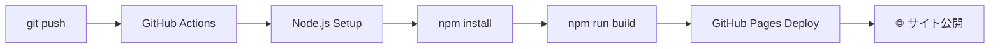

# 🚀 GitHub Pages デプロイガイド

> Discord立ち絵CSS生成ツールをGitHub Pagesで無料公開する完全ガイド

---

## 📋 目次

- [⚡ クイックスタート](#-クイックスタート)
- [🛠️ 初回セットアップ](#️-初回セットアップ)
- [🔄 自動デプロイ](#-自動デプロイ)
- [🌐 アクセス方法](#-アクセス方法)
- [🐛 トラブルシューティング](#-トラブルシューティング)
- [⚙️ 高度な設定](#️-高度な設定)

---

## ⚡ クイックスタート

### 前提条件
- ✅ GitHub アカウント
- ✅ Git インストール済み
- ✅ Node.js 18.0+ インストール済み

### 3ステップでデプロイ
```bash
# 1. リポジトリをPublicに設定
# 2. GitHub Pages を有効化
# 3. コードをプッシュ
git push origin main
```

**🎉 5分後にサイトが公開されます！**

---

## 🛠️ 初回セットアップ

### Step 1: リポジトリ設定

1. **GitHub リポジトリページ** にアクセス
2. **Settings** → **Pages** をクリック
3. **Source** を **"GitHub Actions"** に設定
4. **Save** をクリック

### Step 2: リポジトリをPublicに設定

**GitHub Pages 無料版はPublicリポジトリが必須**

1. **Settings** → **General** → **Repository name**
2. 最下部 **"Change repository visibility"**
3. **"Change visibility"** → **"Make public"**
4. リポジトリ名を入力して確認

### Step 3: ローカルでテスト

```bash
# プロジェクトディレクトリに移動
cd app/discord-css-generator

# 依存関係インストール
npm install

# 開発サーバー起動
npm run dev

# ビルドテスト
npm run build
npm run preview
```

---

## 🔄 自動デプロイ

### デプロイトリガー
以下のいずれかでデプロイが実行されます：

✅ **自動トリガー**
- `master` または `main` ブランチへプッシュ
- `app/discord-css-generator/` 配下のファイル変更時

✅ **手動トリガー**
- GitHub Actions ページから **"Run workflow"**

### デプロイフロー



### ビルド時間
- **初回**: 約3-5分
- **更新**: 約2-3分

---

## 🌐 アクセス方法

### 公開URL
```
https://obsidian-engine.github.io/vtube-tools/app/discord-css-generator/
```

**例:**
```
https://obsidian-engine.github.io/vtube-tools/app/discord-css-generator/
```

### URL確認方法
1. **GitHub Actions** 実行完了後
2. **Settings** → **Pages** で確認
3. **"Visit site"** ボタンをクリック

### カスタムドメイン（オプション）
独自ドメインを使用したい場合：

1. **Settings** → **Pages** → **Custom domain**
2. ドメインを入力（例: `discord-css.example.com`）
3. DNS設定でCNAMEレコードを追加

---

## 🐛 トラブルシューティング

### ❌ よくある問題

| 問題 | 原因 | 解決方法 |
|------|------|----------|
| **404エラー** | ベースURL設定 | `vite.config.js` の `base` 確認 |
| **CSS読み込み失敗** | アセットパス問題 | 相対パス使用を確認 |
| **デプロイ失敗** | Node.js バージョン | Actions ログ確認 |
| **サイト非公開** | Private リポジトリ | Public に変更 |

### 🔍 デバッグ手順

#### 1. GitHub Actions ログ確認
```
GitHub → Actions → 最新のワークフロー実行 → ログ確認
```

#### 2. ローカルビルドテスト
```bash
# プロダクション相当でビルド
NODE_ENV=production npm run build

# 成果物確認
ls -la dist/
```

#### 3. ベースURL確認
```javascript
// vite.config.js 確認
base: process.env.NODE_ENV === 'production' 
  ? '/vtube-tools/app/discord-css-generator/' 
  : './'
```

### 🆘 完全リセット手順

デプロイが完全に壊れた場合：

```bash
# 1. ローカルdistフォルダ削除
rm -rf dist/

# 2. node_modules再インストール
rm -rf node_modules/
npm install

# 3. 手動ビルドテスト
npm run build

# 4. GitHub Actions 再実行
# GitHub UI から "Re-run jobs"
```

---

## ⚙️ 高度な設定

### 🌍 環境変数設定

本番環境専用設定が必要な場合：

```bash
# GitHub Settings → Secrets and variables → Actions
VITE_API_URL=https://api.example.com
VITE_GA_ID=G-XXXXXXXXXX
```

### 📊 分析ツール追加

Google Analytics等を追加する場合：

```javascript
// vite.config.js に追加
define: {
  __VITE_GA_ID__: JSON.stringify(process.env.VITE_GA_ID)
}
```

### 🔒 セキュリティヘッダー

GitHub Pages は基本的なセキュリティヘッダーを自動設定しますが、
より高度な制御が必要な場合は Netlify/Vercel を検討してください。

### 📱 PWA対応

PWA機能を追加したい場合：

```bash
# Vite PWAプラグイン
npm install -D vite-plugin-pwa

# vite.config.js に追加設定
import { VitePWA } from 'vite-plugin-pwa'
```

---

## 📈 パフォーマンス最適化

### 🚀 高速化設定

現在の `vite.config.js` に含まれる最適化：

```javascript
build: {
  cssCodeSplit: false,      // CSS分割無効（小規模なため）
  sourcemap: false,         // ソースマップ無効
  minify: 'terser',         // 最高レベル圧縮
  rollupOptions: {
    output: {
      // キャッシュ最適化用ハッシュ
      entryFileNames: 'assets/[name]-[hash].js',
      chunkFileNames: 'assets/[name]-[hash].js',
      assetFileNames: 'assets/[name]-[hash].[ext]'
    }
  }
}
```

### 📊 パフォーマンス確認

デプロイ後にテスト：

- **PageSpeed Insights**: https://pagespeed.web.dev/
- **GTmetrix**: https://gtmetrix.com/
- **WebPageTest**: https://www.webpagetest.org/

---

## 🔄 継続的デプロイメント

### 開発ワークフロー

```bash
# 1. 機能開発
git checkout -b feature/new-feature
# ... コード変更 ...

# 2. ローカルテスト
npm run dev
npm run build

# 3. プルリクエスト
git push origin feature/new-feature
# GitHub で PR 作成

# 4. マージ後自動デプロイ
# main ブランチにマージされると自動でデプロイ実行
```

### バージョン管理

```bash
# リリースタグ作成
git tag v1.0.0
git push origin v1.0.0

# GitHub Releases でリリースノート作成
```

---

## 🎯 本番運用のベストプラクティス

### ✅ チェックリスト

デプロイ前に必須確認項目：

- [ ] ローカルビルドが成功する
- [ ] テストが全て通る
- [ ] 設定ファイルが正しい
- [ ] 機密情報が含まれていない
- [ ] GitHub Actions が緑色
- [ ] サイトが正常に表示される

### 📝 デプロイログ

重要な変更の記録：

```
2025-01-XX: 初回デプロイ
2025-01-XX: アニメーション機能追加
2025-01-XX: UI改善
```

---

## 🆘 サポート・連絡先

### 問題報告

1. **GitHub Issues**: バグ報告・機能要望
2. **Discussions**: 質問・議論
3. **Email**: 緊急時のみ

### 参考リンク

- **GitHub Pages公式**: https://pages.github.com/
- **Vite公式**: https://vitejs.dev/
- **GitHub Actions**: https://docs.github.com/actions

---

**🚀 Happy Deploying!**