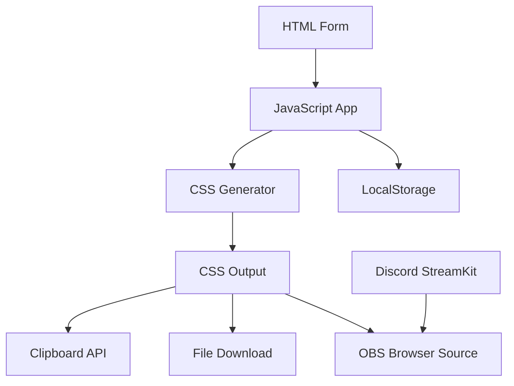

# 🎭 Discord立ち絵CSS生成ツール

[](https://opensource.org/licenses/MIT)
[](https://nodejs.org/)
[](https://vitejs.dev/)

> 🚀 **2025年最新版** - Discord StreamKit→OBS配信用立ち絵CSS生成ツール  
> 発話時の跳ね・光るアニメーション対応で、VTuber配信をプロフェッショナルに！

---

## 📋 目次

- [✨ 特徴](#-特徴)
- [🎯 主な機能](#-主な機能)
- [🛠️ 技術スタック](#️-技術スタック)
- [⚡ クイックスタート](#-クイックスタート)
- [📖 使い方](#-使い方)
- [🎨 カスタマイズ](#-カスタマイズ)
- [🔧 開発者向け](#-開発者向け)
- [❓ よくある質問](#-よくある質問)
- [🐛 トラブルシューティング](#-トラブルシューティング)
- [📄 ライセンス](#-ライセンス)
- [⚖️ 法的注意事項](#️-法的注意事項)

---

## ✨ 特徴

- 🎮 **Discord StreamKit公式API対応** - 安全かつ確実な連携
- 🎨 **リアルタイムプレビュー** - 設定変更が即座に反映
- 📱 **レスポンシブデザイン** - PCもモバイルも快適操作
- 💾 **設定自動保存** - LocalStorageで設定を記憶
- 🔒 **完全クライアントサイド** - サーバー通信一切なし
- 🌙 **ダークモード対応** - 配信環境に優しい
- 📋 **ワンクリックコピー** - 生成CSSを即座にコピー

---

## 🎯 主な機能

### 🎭 立ち絵表示機能
- Discord音声通話中に立ち絵を表示
- 発話時の**跳ね**アニメーション（高さ調整可能）
- 発話時の**光る**エフェクト（グロー効果）
- 画像サイズの自由調整（100px〜800px）

### ⚙️ カスタマイズ機能
- 立ち絵画像URL設定（Discord添付ファイル対応）
- サイズプリセット（小・中・大・横長）
- アニメーション強度調整
- リアルタイムプレビュー

### 💼 配信者向け機能
- OBS Studio完全対応
- CSS生成・コピー・ダウンロード
- 詳細セットアップガイド内蔵
- トラブルシューティング情報

---

## 🛠️ 技術スタック

| 技術 | バージョン | 用途 |
|------|------------|------|
| **HTML5** | - | セマンティックマークアップ |
| **CSS3** | - | アニメーション・レスポンシブ |
| **JavaScript** | ES2022+ | DOM操作・状態管理 |
| **Vite** | 5.0+ | 開発サーバー・ビルドツール |
| **Node.js** | 18.0+ | 開発環境 |

### 📦 依存関係
- **開発依存**: Vite のみ
- **実行環境**: 最新ブラウザ（ES2022対応）
- **外部API**: Discord StreamKit（読み取りのみ）

---

## ⚡ クイックスタート

### 1️⃣ 環境要件
```bash
Node.js 18.0+ 必須
```

### 2️⃣ セットアップ
```bash
# プロジェクトディレクトリに移動
cd app/discord-css-generator

# 依存関係インストール
npm install

# 開発サーバー起動
npm run dev
```

### 3️⃣ アクセス
```
http://localhost:5173
```

---

## 📖 使い方

### 🆔 Step 1: DiscordユーザーID取得

1. **Discord設定** → **詳細設定** → **開発者モード** を **ON**
2. 自分を右クリック → **「ユーザーIDをコピー」**
3. 18桁の数字をメモ

### 🖼️ Step 2: 立ち絵画像準備

**推奨仕様:**
- **形式**: PNG（透過背景）
- **サイズ**: 1000x1500px以下
- **容量**: 5MB以下

**アップロード先:**
- Discord サーバー添付ファイル
- GitHub リポジトリ（public）
- CDN サービス（Imgur等）

### ⚙️ Step 3: CSS生成

1. **ユーザーID** と **画像URL** を入力
2. **詳細設定** で サイズ・アニメーション調整
3. **「✨ CSS生成」** をクリック
4. **「📋 コピー」** でCSSをクリップボードにコピー

### 🎥 Step 4: OBS設定

1. **[Discord StreamKit](https://streamkit.discord.com/overlay)** にアクセス
2. **Voice Widget** → **SERVER/VOICE CHANNEL** を選択
3. **Copy** でStreamKit URLを取得
4. **OBS** で **ブラウザソース** を新規作成
5. **URL** にStreamKit URLを設定
6. **カスタムCSS** に生成したCSSを貼り付け
7. **幅800, 高さ600** に設定

### 🎉 完成！

発話時に立ち絵が跳ねて光る配信環境の完成です！

---

## 🎨 カスタマイズ

### 📐 サイズプリセット

| プリセット | 幅 | 高さ | 用途 |
|-----------|-----|------|------|
| **小サイズ** | 300px | 450px | サブカメラ・モバイル |
| **中サイズ** | 400px | 600px | 標準・バランス重視 |
| **大サイズ** | 500px | 750px | メイン画面・迫力重視 |
| **横長** | 600px | 400px | ワイド画面・チャット併用 |

### 🦘 アニメーション設定

```css
/* 跳ね高さ調整例 */
transform: translateY(-15px); /* 標準 */
transform: translateY(-30px); /* 激しい */
transform: translateY(-5px);  /* 控えめ */
```

### 💡 光エフェクト調整

```css
/* グロー強度調整例 */
filter: brightness(120%) drop-shadow(0 0 20px rgba(255,255,255,1));
```

---

## 🔧 開発者向け

### 📁 プロジェクト構造

```
discord-css-generator/
├── index.html          # メインHTML
├── package.json        # 依存関係定義
├── vite.config.js      # Vite設定
├── src/
│   ├── main.js         # JavaScriptロジック
│   └── style.css       # メインスタイル
├── dist/               # ビルド成果物
└── node_modules/       # 依存関係
```

### 🏗️ アーキテクチャ



### ⚡ ビルド・デプロイ

```bash
# プロダクションビルド
npm run build

# プレビューサーバー
npm run preview

# 静的ファイル配信
npm run serve
```

### 🧪 デバッグ

**ブラウザ開発者ツール:**
```javascript
// 設定状態確認
console.log(localStorage.getItem('discord-css-generator-settings'));

// CSS生成ロジックテスト
new CSSGeneratorApp();
```

---

## ❓ よくある質問

### Q1: 立ち絵が表示されない
**A:** 以下を確認してください：
- ユーザーIDが正確（18桁数字）
- StreamKit URLが正しい
- 画像URLがアクセス可能
- OBS設定（幅800, 高さ600）

### Q2: アニメーションが動かない
**A:** ブラウザキャッシュをクリアし、ページを更新してください。

### Q3: 複数人の立ち絵表示は可能？
**A:** 現バージョンは1人用です。複数人対応は今後のアップデート予定です。

### Q4: モバイル配信での使用は？
**A:** 技術的には可能ですが、PC環境を推奨します。

### Q5: 商用利用は可能？
**A:** MITライセンスのため商用利用可能です。詳細は[ライセンス](#-ライセンス)をご確認ください。

---

## 🐛 トラブルシューティング

### ❌ 一般的な問題

| 問題 | 原因 | 解決法 |
|------|------|--------|
| **CSS生成できない** | 入力値エラー | フォームの赤字エラーを確認 |
| **立ち絵表示されない** | ユーザーID間違い | 開発者モードでID再取得 |
| **アニメーション停止** | ブラウザキャッシュ | Ctrl+F5で強制更新 |
| **OBS表示トラブル** | サイズ設定ミス | 幅800・高さ600に設定 |

### 🔍 詳細デバッグ

**1. ブラウザコンソールでエラー確認:**
```javascript
// F12 → Console → エラーメッセージ確認
```

**2. StreamKit URL妥当性チェック:**
```
正: https://streamkit.discord.com/overlay/voice/[SERVER_ID]/[CHANNEL_ID]
誤: https://discord.com/... (通常のDiscord URL)
```

**3. CSS妥当性チェック:**
```css
/* 生成CSSの先頭行確認 */
/* Discord立ち絵CSS - ユーザーID: [YOUR_ID] */
```

### 🆘 サポート

問題が解決しない場合：
1. **GitHub Issues** で報告
2. **動作環境** を明記（OS, ブラウザ, OBSバージョン）
3. **エラーメッセージ** のスクリーンショット添付

---

## 📄 ライセンス

```
MIT License

Copyright (c) 2025 Obsidian Engine

Permission is hereby granted, free of charge, to any person obtaining a copy
of this software and associated documentation files (the "Software"), to deal
in the Software without restriction, including without limitation the rights
to use, copy, modify, merge, publish, distribute, sublicense, and/or sell
copies of the Software, and to permit persons to whom the Software is
furnished to do so, subject to the following conditions:

The above copyright notice and this permission notice shall be included in all
copies or substantial portions of the Software.

THE SOFTWARE IS PROVIDED "AS IS", WITHOUT WARRANTY OF ANY KIND, EXPRESS OR
IMPLIED, INCLUDING BUT NOT LIMITED TO THE WARRANTIES OF MERCHANTABILITY,
FITNESS FOR A PARTICULAR PURPOSE AND NONINFRINGEMENT. IN NO EVENT SHALL THE
AUTHORS OR COPYRIGHT HOLDERS BE LIABLE FOR ANY CLAIM, DAMAGES OR OTHER
LIABILITY, WHETHER IN AN ACTION OF CONTRACT, TORT OR OTHERWISE, ARISING FROM,
OUT OF OR IN CONNECTION WITH THE SOFTWARE OR THE USE OR OTHER DEALINGS IN THE
SOFTWARE.
```

---

## ⚖️ 法的注意事項

### 🔒 セキュリティ・プライバシー

- **✅ 完全クライアントサイド処理** - サーバーへのデータ送信なし
- **✅ ローカルストレージ使用** - 機密情報は保存されません
- **✅ 外部通信なし** - Discord StreamKit読み取りのみ
- **✅ 個人情報収集なし** - ユーザーIDは表示制御のみに使用

### 📋 Discord利用規約について

**✅ 適法な利用:**
- Discord StreamKit **公式API** を使用
- Discordクライアントの **改変なし**
- **手動設定**のみ（自動化なし）
- Discord **認証トークン未使用**

**⚠️ 注意事項:**
- 生成CSSは**自己責任**で使用してください
- Discordの利用規約変更時は使用を中止してください
- **商用配信**での使用は各自で規約を確認してください

### 🏷️ 商標について

- "Discord"は Discord Inc. の商標です
- 本ツールは Discord Inc. との提携・承認を示すものではありません
- 商標の使用は説明目的のみであり、商標権侵害を意図しません

### 📜 免責事項

```
本ソフトウェアは「現状のまま」提供され、明示または暗示を問わず、
商品性、特定目的への適合性、非侵害性を含むがこれに限定されない
いかなる種類の保証もありません。

作者または著作権者は、契約行為、不法行為、またはその他の行為に
関係なく、本ソフトウェアまたは本ソフトウェアの使用または
その他の取引に起因または関連して生じる請求、損害、その他の責任
について責任を負いません。
```

### 🔗 関連リンク

- **Discord StreamKit**: https://streamkit.discord.com/
- **Discord Developer Terms**: https://discord.com/developers/docs/legal
- **OBS Studio**: https://obsproject.com/

---

## 🤝 コントリビューション

プルリクエスト・Issue報告を歓迎します！

### 📋 貢献方法
1. Fork this repository
2. Create feature branch (`git checkout -b feature/amazing-feature`)
3. Commit changes (`git commit -m 'Add amazing feature'`)
4. Push to branch (`git push origin feature/amazing-feature`)
5. Open Pull Request

### 🎯 開発ロードマップ
- [ ] 複数人対応
- [ ] テーマプリセット
- [ ] PWA対応
- [ ] 多言語対応

---

## 👥 制作者

**Obsidian Engine** - 配信者向けツール開発チーム

- 📧 Email: contact@obsidian-engine.com
- 🌐 Website: https://obsidian-engine.github.io
- 📦 GitHub: https://github.com/obsidian-engine

---

<div align="center">

**🎭 楽しい配信ライフを！**
</div>