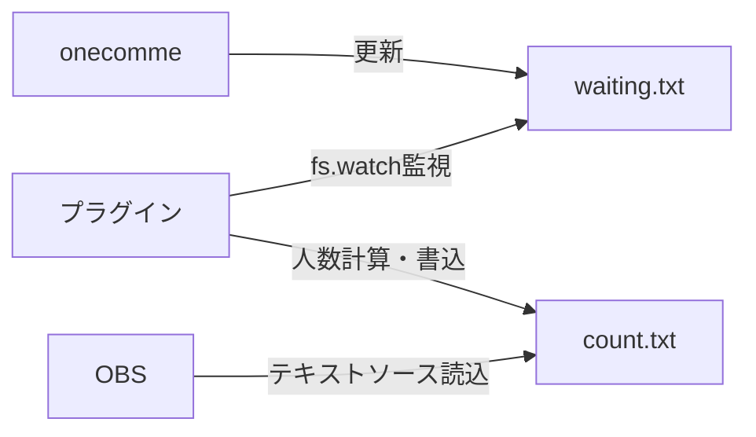

# PRD: わんこめ参加型機能人数表示ツール

作成日: 2026-02-08 | 更新日: 2026-02-08 | ステータス: Reviewed

## 1. 概要

### 目的
OBS配信画面にわんこめの参加型機能の現在の参加人数をリアルタイムで表示する。

### 背景・課題
- わんこめ（onecomme）の参加型機能では、参加者情報が`waiting.txt`に記録される
- 配信者は現在の参加人数を視覚的に確認したい
- OBSで表示するため、軽量でシンプルな仕組みが必要

### スコープ

#### In Scope
- ✅ waiting.txtの監視と人数カウント
- ✅ count.txtへの人数書き込み（OBS連携用）
- ✅ ブラウザベースのシンプルなUI
- ✅ フォントサイズ・色のカスタマイズ
- ✅ 接頭辞/接尾辞のカスタマイズ
- ✅ エラー時の前回値維持

#### Out of Scope
- ❌ 参加者名の表示
- ❌ 参加者の追加・削除機能
- ❌ 参加履歴の記録・統計
- ❌ 複数のwaiting.txtファイルの同時監視
- ❌ 設定の永続化（リロード時は初期値に戻る）

## 2. ユーザー

### ターゲットユーザー
- **配信者（VTuber含む）**: わんこめを使用して参加型配信を行う人

### ユーザーストーリー
1. 配信者として、現在の参加人数をOBS画面に表示したい
2. 配信者として、人数表示のデザインを配信画面に合わせてカスタマイズしたい
3. 配信者として、waiting.txtが一時的に読めなくてもエラー表示が出ないようにしたい

## 3. システム構成

### 技術スタック
- **実装形式**: わんこめプラグイン（Node.js環境）
- **ファイル監視**: fs.watch()によるイベント駆動監視
- **ファイル操作**: Node.js fs API（同期/非同期）
- **言語**: JavaScript（CommonJS形式）

### データフロー



### ファイル構成

```
waiting-count/
├── plugin.js            # プラグインメインロジック
├── package.json        # プラグイン定義
├── PRD.md              # このファイル
├── REVIEW.md           # レビュー結果
└── README.md           # 使用方法・インストール手順
```

## 4. 機能要件

### 4.1 待機ファイル監視

| 項目 | 仕様 |
|------|------|
| 監視対象 | `/Users/daichi/Library/Application Support/onecomme/waiting.txt` |
| 監視方式 | Node.js `fs.watch()`（イベント駆動） |
| 解析ルール | 1行目を読み込み、スペース区切りで分割、各要素から番号を抽出、最大値が参加人数 |
| パース例 | `1:佐藤 2:小林 3:武藤` → 最大番号3 → 参加人数3人 |
| エラー処理 | 読み取り失敗時は前回の人数を維持、コンソールログ出力 |
| 初回読込 | プラグイン起動時（init()）に即座に読込 |

### 4.2 人数カウント

| 項目 | 仕様 |
|------|------|
| カウント方式 | waiting.txt内の番号の最大値 |
| 空ファイル | ファイルが空または1行目が空 → 0人 |
| 初期値 | ファイル未読込時は0人 |
| 更新タイミング | ファイル読み込み成功時、人数が変わった場合のみcount.txtを更新 |

### 4.3 結果書き込み

| 項目 | 仕様 |
|------|------|
| 出力先 | `/Users/daichi/Library/Application Support/onecomme/waiting_count.txt` |
| 出力形式 | `{接頭辞}{人数}{接尾辞}` |
| デフォルト | `参加者: {人数}人` （例: 参加者: 2人） |
| 更新タイミング | 人数変更時のみ書き込み（無駄な書き込み防止） |
| 書き込み方式 | アトミック書き込み（tmpファイル→rename） |
| 文字コード | UTF-8 |
| エラー処理 | 書き込み失敗時はコンソールログ出力、次回変更時にリトライ |

### 4.4 プラグイン設定

| 設定項目 | 設定方法 | 初期値 |
|---------|---------|--------|
| 接頭辞 | プラグインコード内で定数定義 | `参加者: ` |
| 接尾辞 | プラグインコード内で定数定義 | `人` |
| 出力ファイル名 | プラグインコード内で定数定義 | `waiting_count.txt` |

**注意**: フォントサイズ・色のカスタマイズはOBS側のテキストソース設定で行う。

### 4.5 状態遷移

| 状態 | 説明 | 遷移条件 |
|------|------|---------|
| 初期化中 | init()実行、waiting.txtの初回読込 | → 監視中 |
| 監視中 | fs.watch()でwaiting.txtの変更を監視 | ファイル変更検知 → 人数更新<br>読込失敗 → エラー処理（前回値維持） |
| 人数更新 | 人数を再計算してcount.txtに書き込み | 書き込み成功 → 監視中<br>書き込み失敗 → エラー処理 → 監視中 |
| 終了処理 | destroy()実行、fs.watchを停止 | プラグイン終了 |

## 5. 非機能要件

### 5.1 パフォーマンス
- ファイル読み込み: 50ms以内（通常時）
- 変更検知レイテンシ: 即座（fs.watchイベント駆動）
- メモリ使用量: 5MB以下（プラグインとして軽量）
- CPU使用率: アイドル時 0%（イベント駆動のため）

### 5.2 セキュリティ
- ファイルアクセスはローカルファイルシステムに限定
- XSS対策: ユーザー入力をサニタイズ（接頭辞/接尾辞）
- パス固定: ハードコードされたパス以外にアクセスしない

### 5.3 可用性
- ファイル読み込み失敗時も前回値を維持
- わんこめ再起動時に即座にプラグイン再起動
- OBS側のテキストソース読み込みエラーを防ぐ（count.txtは常に有効な内容）
- プラグイン無効化時は監視を即座に停止（リソース開放）

### 5.4 運用性
- ログ出力: コンソールにエラー・起動・終了ログ出力
- 動作確認: わんこめのプラグイン管理画面で有効/無効切替
- リトライ: fs.watchは自動で再接続（ファイル削除・再作成にも対応）

## 6. 受け入れ基準

### 必須要件
- [ ] waiting.txtをfs.watch()で監視し、変更時に人数をカウントできる
- [ ] waiting_count.txtに`参加者: X人`形式で書き込める
- [ ] OBSのテキストソースでcount.txtを読み込むと人数が表示される
- [ ] waiting.txtが読めない場合でも前回の人数が維持される
- [ ] わんこめ起動時にプラグインが自動で有効化される

### カスタマイズ要件
- [ ] 接頭辞/接尾辞をプラグインコード内で変更できる
- [ ] ファイル名をプラグインコード内で変更できる
- [ ] フォントサイズ・色はOBS側で設定できる

### エラーハンドリング
- [ ] waiting.txtが存在しない場合、0人と表示される（count.txtに0を書き込む）
- [ ] waiting.txtの内容が空の場合、0人と表示される
- [ ] ファイル権限エラー時、コンソールにエラーログが出力され、前回値を維持
- [ ] waiting_count.txtへの書き込み失敗時、コンソールにエラーログが出る

## 7. 実装上の注意点

### わんこめプラグインAPI
- **module.exports形式**: CommonJS形式でエクスポート
- **必須メソッド**: `init()`, `destroy()`
- **ライフサイクル**: わんこめ起動時にinit()、終了時にdestroy()が呼ばれる
- **Node.js API**: fs, path等のNode.js標準モジュールが使用可能

### waiting.txtのパース

**実際のフォーマット例**: `1:佐藤 2:小林 3:武藤`

**パース手順**:
1. ファイルから1行目を読み込む（複数行ある場合は1行目のみ使用）
2. スペース（` `）で分割 → `["1:佐藤", "2:小林", "3:武藤"]`
3. 各要素から番号部分を抽出（`:` の前の数字）
4. 番号の最大値 = 参加人数

**エッジケース**:
- ファイルが空 → 参加人数 0人
- ファイルが存在しない → 参加人数 0人
- フォーマット不正（`:`がない等）→ その要素はスキップ
- 番号が数値でない → その要素はスキップ

**文字コード**: UTF-8を想定

### アトミック書き込み
- **手法**: 一時ファイルに書き込み→fs.renameSync()でリネーム
- **理由**: OBSが読み込み中に書き込むと表示が乱れるのを防ぐ
- **実装例**: `onecomme_waiting_count.tmp` → `waiting_count.txt`

### fs.watch()の注意点
- **macOSの挙動**: ファイル変更時に複数回イベントが発火する可能性
- **対策**: デバウンス処理（100ms以内の連続イベントは無視）
- **ファイル削除**: waiting.txtが削除された場合、fs.watchはエラーを出すため、try-catchで再監視

## 8. 次のアクション

- [ ] `/plan` で実装計画を立てる
- [ ] `/dev` で実装開始
- [ ] OBSでの動作テスト
